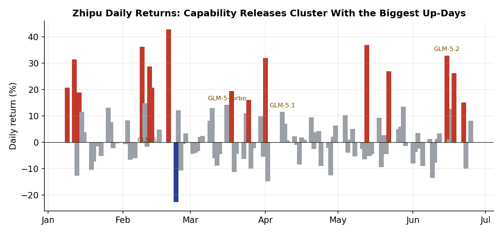
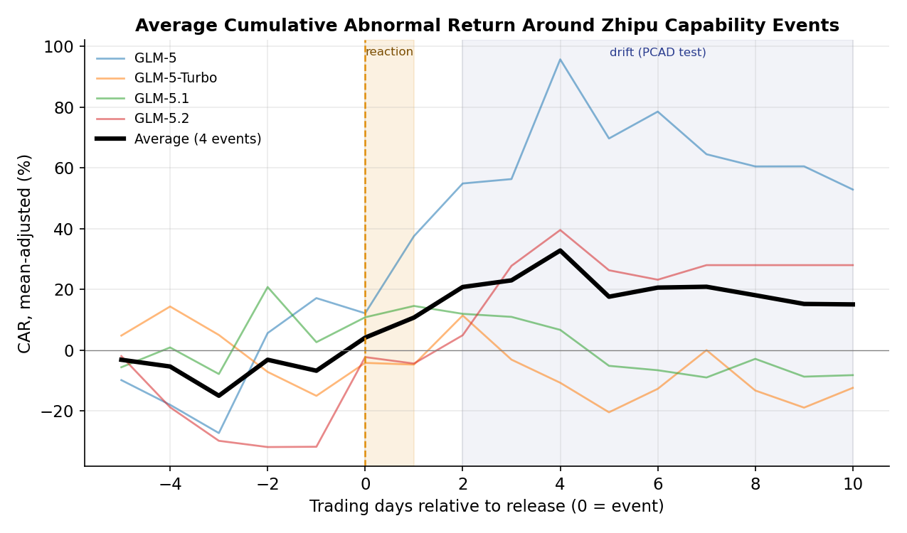
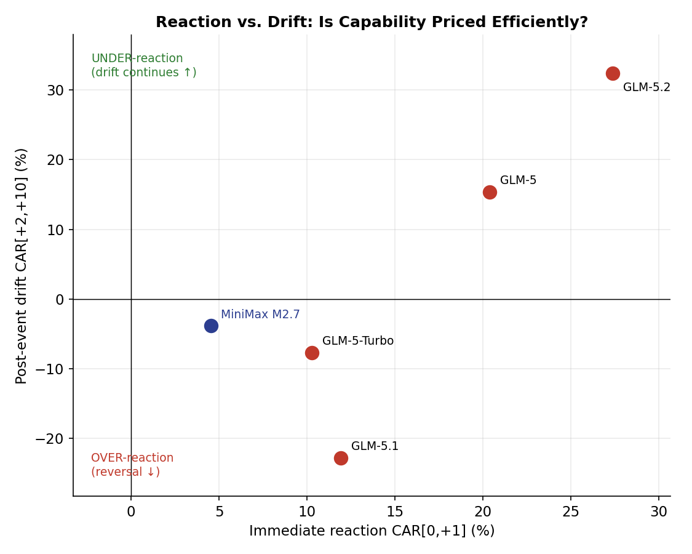
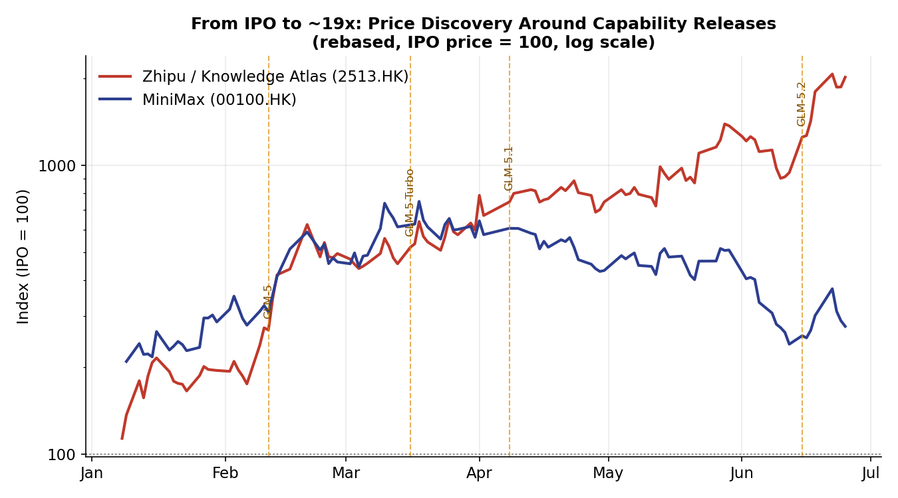

# Capability Surprise, Not Earnings Surprise
### An event-driven read of how the market prices a pre-revenue AI lab (Zhipu, 2513.HK)

> A foundation-model lab has **no earnings to be surprised by**. So we replace the classic *earnings*
> surprise with a **capability surprise** — a model release or benchmark-leaderboard jump — and ask the
> only question that matters for market efficiency: *does the price react once and stop, or does it keep
> drifting?* This is the AI analogue of post-earnings-announcement drift (PEAD) → **PCAD**.
>
> Method is deliberately transparent and small-sample-honest (the same posture as
> *Earnings-Surprise-Market-Efficiency*): mean-adjusted abnormal returns on authoritative Tushare prices,
> three event windows — leakage `[-5,-1]`, reaction `[0,+1]`, drift `[+2,+10]`.

---

## 1. The data finds the events before we tell it the dates
We first flagged Zhipu's six largest abnormal up-days *blind*, then checked them against the GLM release log.
They line up almost one-for-one:

| Data-found spike | Daily ret | Matches |
|---|---|---|
| 2026-02-09 → 02-11 | +36% | **GLM-5** launch |
| 2026-04-01 | +32% | run-up *into* **GLM-5.1** (leakage) |
| 2026-06-15 | +33% | **GLM-5.2** launch (first trading day after 06-13) |
| 2026-02-20 / 05-13 | +43% / +37% | open-weight drop / commercial news *(to map)* |

Two un-mapped spikes are themselves a finding: **the market is trading a capability calendar we have to reverse-engineer.**
See `figures/fig2_daily_returns.png`.

## 2. Reaction is loud; drift is where efficiency breaks
Average CAR across the four GLM events:

| Window | Avg CAR | Read |
|---|---:|---|
| Leakage `[-5,-1]` | **−6.8%** | no systematic front-running |
| Reaction `[0,+1]` | **+17.5%** | market *does* price capability, fast |
| Drift `[+2,+10]` | **+4.3%** (but bimodal) | **PCAD present** — see below |

The average hides the real story — the drift sign depends on *what kind* of release it was:

## 3. Three cases that kill the "standard answer"
- **GLM-5.2 (06-15) — under-reaction / momentum.** −32% leakage (early-June sector pullback), then **+27% reaction and +32% further drift**. A genuine SOTA jump (MIT open weights, 1M context) kept re-rating for two weeks. *Efficiency fails on the slow side.*
- **GLM-5.1 (04-08) — over-reaction / reversal.** +12% reaction then **−23% drift**: an *incremental* upgrade was "buy the rumor, sell the news." *Efficiency fails on the fast side.*
- **MiniMax M2.7 (03-18) — the cross-section test.** Muted +4.5% reaction, −3.8% drift; MiniMax peaked mid-March and then **de-rated ~60% from its high while Zhipu kept climbing** (`fig1`). Same sector, opposite paths → **capability surprise, not sector beta, drives the cross-section.**

## 4. Verdict (the non-textbook one)
The market is **neither efficient nor a blind bubble**. It prices capability *immediately and discriminately*
(it separates Zhipu from MiniMax on model quality, not sector), but it **mis-times magnitude**: it under-reacts
to true SOTA leaps and over-reacts to incremental ones. The ~19x / ~600x-P/S re-rating is best read as
**capability-momentum with selective overreaction** — a measurable behavioural signature, not a morality tale
about "AI hype." This is exactly the bridge into the valuation chapter: the fundamental anchor (DCF + real
options) tells you *the level*; the event study tells you *how price gets there*.

## 5. Honesty box (so the result is believable)
- n = 4 single-firm events (+1 peer) over ~5 months → **diagnostic, not significant**; no t-stats claimed.
- Mean-adjusted model (no HK index in the data feed); drift windows overlap adjacent events in a fast release cadence.
- Source dates for releases conflict across outlets; **prices are authoritative, dates are best-effort** and were validated against the data-found spikes in §1.
- Robustness to-do: peer-adjusted abnormal returns (benchmark = the other AI stock), wider event panel, NLP-scored surprise magnitude.

*Inputs: Tushare `hk_daily` → `data/`; CAR table → `eventstudy/zhipu_car.csv`; charts → `figures/`.*
